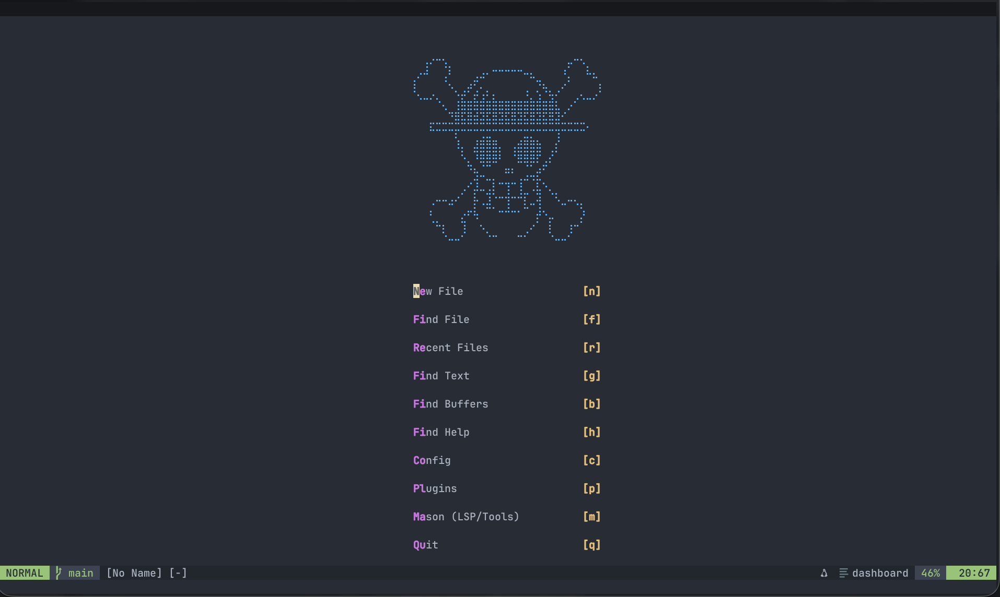

# Modern Neovim Configuration

A comprehensive, modular Neovim configuration designed for professional multi-language development with VSCode-like features.



## ✨ Features

### 🎯 Core Capabilities

- **Multi-Language Support**: C/C++, Rust, Python, TypeScript, JavaScript, HTML, CSS, Lua, Markdown, VHDL, Verilog
- **LSP Integration**: 12+ language servers with auto-completion, diagnostics, and code actions
- **VSCode-like UI**: Buffer tabs, statusline, file explorer, integrated terminal
- **Debugging**: Full DAP support for C/C++, Rust, Python, Go, and JavaScript
- **Git Integration**: Gitsigns, lazygit, diffview for comprehensive version control
- **Extensive Documentation**: Every configuration option is thoroughly commented

### 🔧 Development Tools

- **Code Formatting**: Automatic formatting on save with conform.nvim
- **Linting**: Real-time linting for 8+ languages
- **Code Navigation**: Treesitter-powered syntax highlighting and text objects
- **Fuzzy Finding**: Telescope for files, text, symbols, and more
- **Terminal**: Integrated terminal with custom layouts

### ⌨️ Productivity Features

- Multi-cursor editing (Ctrl+d like VSCode)
- Smart auto-pairs and surround
- TODO comment highlighting and navigation
- Context-aware commenting
- Enhanced increment/decrement
- Quick file tree with Neo-tree

## 📁 Project Structure

```
nvim/
├── init.lua                    # Main configuration entry point
├── lua/
│   ├── core/
│   │   ├── health.lua          # Health check diagnostics
│   │   └── plugins/            # All plugin configurations
│   │       ├── autopairs.lua   # Auto-close brackets/quotes
│   │       ├── colorscheme.lua # Theme configuration
│   │       ├── completion.lua  # Auto-completion (blink.cmp)
│   │       ├── debug.lua       # Debugging (DAP)
│   │       ├── editor.lua      # Editor enhancements
│   │       ├── formatting.lua  # Code formatters
│   │       ├── gitsigns.lua    # Git integration
│   │       ├── indent_line.lua # Indent guides
│   │       ├── lint.lua        # Code linters
│   │       ├── lsp.lua         # Language servers
│   │       ├── neo-tree.lua    # File explorer
│   │       ├── telescope.lua   # Fuzzy finder
│   │       ├── terminal.lua    # Terminal integration
│   │       ├── treesitter.lua  # Syntax highlighting
│   │       ├── ui.lua          # UI components
│   │       └── utilities.lua   # Helper plugins
│   └── custom/
│       └── plugins/            # Your custom plugins
│           └── init.lua        # Add your plugins here
└── scripts/
    ├── setup.sh                # Auto-detect OS setup
    ├── setup-ubuntu.sh         # Ubuntu-specific setup
    └── setup-macos.sh          # macOS-specific setup
```

## 🚀 Installation

### Prerequisites

**Required:**

- Neovim >= 0.10.0
- Git
- A C compiler (gcc/clang)
- Make
- [ripgrep](https://github.com/BurntSushi/ripgrep)
- [fd](https://github.com/sharkdp/fd)

**Recommended:**

- A [Nerd Font](https://www.nerdfonts.com/) (set `vim.g.have_nerd_font = true` in init.lua)
- Node.js and npm (for TypeScript/JavaScript support)
- Python 3 with pip (for Python support)
- Rust with cargo (for Rust support and build tools)
- Clipboard tool (xclip/xsel/win32yank)

### Quick Install

**Linux / macOS:**

```bash
# Backup existing config
mv ~/.config/nvim ~/.config/nvim.backup

# Clone this repository
git clone <your-repo-url> ~/.config/nvim

# Run automated setup (installs tools and dependencies)
cd ~/.config/nvim
./scripts/setup.sh

# Start Neovim - plugins will auto-install
nvim
```

**Windows (PowerShell):**

```powershell
# Backup existing config
Move-Item $env:LOCALAPPDATA\nvim $env:LOCALAPPDATA\nvim.backup

# Clone this repository
git clone <your-repo-url> $env:LOCALAPPDATA\nvim

# Start Neovim - plugins will auto-install
nvim
```

### Manual Installation

If you prefer manual setup or the automated script doesn't work for your system:

1. **Install Neovim** (version 0.10+)
   - Ubuntu: `sudo apt install neovim` or use AppImage
   - macOS: `brew install neovim`
   - Windows: Download from [neovim.io](https://neovim.io/)

2. **Install basic tools:**

   ```bash
   # Ubuntu/Debian
   sudo apt install git gcc make ripgrep fd-find xclip

   # macOS
   brew install git gcc make ripgrep fd

   # Arch
   sudo pacman -S git gcc make ripgrep fd
   ```

3. **Clone this config:**

   ```bash
   git clone <your-repo-url> ~/.config/nvim
   ```

4. **Launch Neovim:**

   ```bash
   nvim
   ```

   Plugins will install automatically via lazy.nvim.

## 📚 Language Support

Each language has LSP, formatting, and linting configured:

| Language | LSP Server | Formatter | Linter |
|----------|-----------|-----------|--------|
| C/C++ | clangd | clang-format | clang-tidy |
| Rust | rust_analyzer | rustfmt | clippy |
| Python | pyright | black + isort | pylint + mypy |
| TypeScript/JS | ts_ls | prettier | eslint_d |
| HTML | html | prettier | - |
| CSS | cssls | prettier | - |
| Lua | lua_ls | stylua | - |
| Markdown | marksman | prettier | markdownlint |
| JSON | jsonls | prettier | jsonlint |
| YAML | yamlls | prettier | yamllint |
| VHDL | vhdl_ls | - | - |
| Verilog | verible | - | - |

Additional tools (shellcheck, hadolint for Dockerfiles) are also configured.

## ⌨️ Key Bindings

**Leader key:** `Space`

### File Operations

| Key | Action |
|-----|--------|
| `<leader>e` | Toggle file explorer |
| `<leader>ff` | Find files |
| `Ctrl+p` | Quick file search |
| `<leader>fg` | Find git files |
| `<leader>fr` | Recent files |
| `<leader>sg` | Live grep (search in files) |
| `<leader>sw` | Search word under cursor |

### Buffer Navigation

| Key | Action |
|-----|--------|
| `Shift+h` | Previous buffer |
| `Shift+l` | Next buffer |
| `<leader>bd` | Delete buffer |
| `<leader><leader>` | Find buffers |

### Window Management

| Key | Action |
|-----|--------|
| `Ctrl+h/j/k/l` | Navigate windows |
| `Ctrl+↑/↓/←/→` | Resize windows |
| `Ctrl+s` | Save file |

### Code Actions

| Key | Action |
|-----|--------|
| `gd` | Go to definition |
| `gr` | Find references |
| `gI` | Go to implementation |
| `K` | Hover documentation |
| `<leader>ca` | Code action |
| `<leader>rn` | Rename symbol |
| `<leader>cf` | Format code |
| `<leader>cl` | Lint file |

### Git

| Key | Action |
|-----|--------|
| `<leader>gg` | Open lazygit |
| `<leader>gh` | Git history (diffview) |
| `]c` / `[c` | Next/previous hunk |
| `<leader>hs` | Stage hunk |
| `<leader>hr` | Reset hunk |
| `<leader>hp` | Preview hunk |
| `<leader>hb` | Blame line |

### Debugging

| Key | Action |
|-----|--------|
| `F5` | Continue/Start |
| `F10` | Step over |
| `F11` | Step into |
| `F12` | Step out |
| `<leader>db` | Toggle breakpoint |
| `<leader>dB` | Conditional breakpoint |
| `<leader>dr` | Open REPL |

### Terminal

| Key | Action |
|-----|--------|
| `Ctrl+\` | Toggle terminal |
| `<leader>tf` | Float terminal |
| `<leader>th` | Horizontal terminal |
| `<leader>tv` | Vertical terminal |

### Other

| Key | Action |
|-----|--------|
| `Ctrl+d` | Multi-cursor (like VSCode) |
| `Alt+j/k` | Move line up/down |
| `]t` / `[t` | Next/previous TODO comment |
| `<leader>st` | Search TODOs |

## 🎨 Customization

### Adding Your Own Plugins

Add plugins to `lua/custom/plugins/init.lua`:

```lua
return {
  {
    'your-name/your-plugin',
    config = function()
      require('your-plugin').setup({
        -- Your configuration
      })
    end,
  },
}
```

### Changing Color Scheme

Edit `lua/core/plugins/colorscheme.lua`. Uncomment one of the alternative themes (TokyoNight, Catppuccin, Gruvbox) or add your own.

### Modifying Keybindings

Keybindings are defined in:

- `init.lua` - Global keybindings
- Individual plugin files - Plugin-specific keybindings

### Adjusting LSP Servers

Edit `lua/core/plugins/lsp.lua` to add/remove language servers or change their configuration.

## 🔍 Health Check

After installation, run health check to verify everything:

```vim
:checkhealth
```

This will show:

- Neovim version
- Provider status (Python, Node, Ruby)
- External tool availability
- Plugin status

## 🛠️ Troubleshooting

### Plugins Not Installing

```vim
:Lazy sync
```

### LSP Server Not Working

1. Check if server is installed: `:Mason`
2. Install missing servers: `:MasonInstall <server-name>`
3. Check LSP status: `:LspInfo`

### Formatter Not Working

1. Check if formatter is installed: `:Mason`
2. Manually format: `<leader>cf`
3. Check conform status: `:ConformInfo`

### Performance Issues

- Large files: TreeSitter may slow down. Disable with `:TSBufDisable highlight`
- Many plugins: Review `lua/core/plugins/` and disable unwanted ones
- Startup time: Run `:Lazy profile` to identify slow plugins

## 📖 Learning Resources

### Neovim

- [Neovim Documentation](https://neovim.io/doc/)
- [Learn Vim Inside Vim](https://github.com/iggredible/Learn-Vim): `:Tutor`

### This Configuration

- Read `init.lua` - Main configuration file
- Explore `lua/core/plugins/` - Each file is extensively commented
- Check `:help` for any command or setting

### Plugins

Each plugin has detailed documentation:

- `:help lazy.nvim` - Plugin manager
- `:help telescope.nvim` - Fuzzy finder
- `:help lspconfig` - LSP configuration
- And more...

## 🙏 Credits

This configuration is built on top of:

- [lazy.nvim](https://github.com/folke/lazy.nvim) - Plugin manager
- [nvim-lspconfig](https://github.com/neovim/nvim-lspconfig) - LSP configurations
- [nvim-treesitter](https://github.com/nvim-treesitter/nvim-treesitter) - Treesitter integration
- And many other excellent Neovim plugins

Inspired by the original [kickstart.nvim](https://github.com/nvim-lua/kickstart.nvim) project.

## 📝 License

MIT License - See [LICENSE.md](LICENSE.md) for details.

## 🤝 Contributing

This is a personal configuration, but feel free to:

- Fork and customize for your needs
- Report bugs or suggest improvements
- Share your own configuration ideas

## 📮 Support

- Check `:checkhealth` for diagnostics
- Review plugin documentation with `:help <plugin-name>`
- Search issues in respective plugin repositories
- Consult Neovim documentation: `:help`

---

**Happy coding! 🚀**
